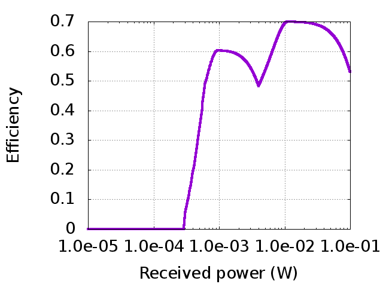
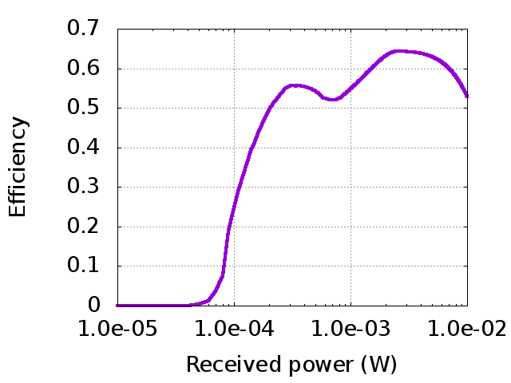
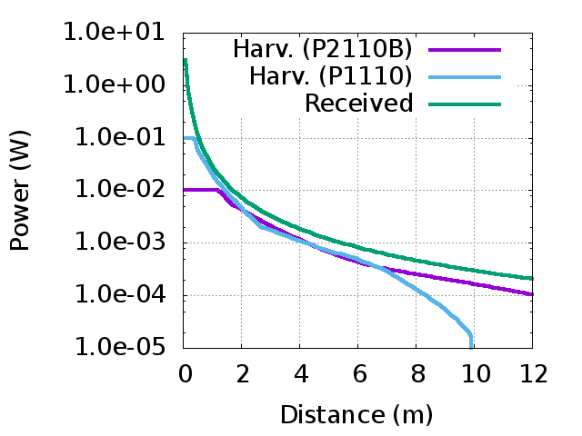

Powercast P1110/P2110B efficiency calculator
============================================

migration from gforge.inria.fr

The script takes as input the distance between the source and the
destination as well as the harvester type and it computes the
(approximate) harvested power. \
 \
 For information about Powercast harvesting modules, click
[here](http://www.powercastco.com/).

Source code
-----------

[v1.3](test.pl)\
 usage example: perl test.pl 5 p2110

Efficiency vs Received power
----------------------------

  ---------------- -----------------
  P1110            P2110B
     
  ---------------- -----------------

Power vs Distance
-----------------

  -------------------
  
  -------------------
